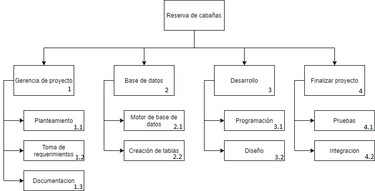

# Estructuracion del proyecto

## 1 Diagrama del proyecto

## 2 Diccionario de la estructura

|       Codigo: 1.1      |                 Nombre: Planteamiento                |
|:----------------------:|:----------------------------------------------------:|
|       Descripcion      |              Se plantea la problematica              |
|       Responsable      |                   Director de proyecto                   |
|        Recursos        |                   Matias Maldonado                   |
|        Duracion        |                        3 dias                        |
|       Resultados       |  Identificar la problematica y plantear una solucion |
|       Restriccion      |                       No aplica                      |
|       Dependencia      |                       No aplica                      |
| Criterio de aceptacion | aprobacion por el equipo de trabajo y el stakeholder |

|       Codigo: 1.2      |               Nombre: Toma de requerimientos               |
|:----------------------:|:----------------------------------------------------------:|
|       Descripcion      |  reunión con el stakeholder para la toma de requerimientos |
|       Responsable      |                      Director de proyecto                      |
|        Recursos        |                      Matias Maldonado                      |
|        Duracion        |                           2 dias                           |
|       Resultados       | Requerimientos funcionales y no funcionales bien definidos |
|       Restriccion      |                          No aplica                         |
|       Dependencia      |                          No aplica                         |
| Criterio de aceptacion |    aprobacion por el equipo de trabajo y el stakeholder    |

|       Codigo: 1.3      |              Nombre: Documentacion              |
|:----------------------:|:-----------------------------------------------:|
|       Descripcion      |       Se genera documentacion del proyecto      |
|       Responsable      |           Jefe de proyecto y analista           |
|        Recursos        |          Matias Maldonado, Matias Nuñez         |
|        Duracion        |                      4 dias                     |
|       Resultados       | Documentacion completa y detallada para entrega |
|       Restriccion      |                    No aplica                    |
|       Dependencia      |                    No aplica                    |
| Criterio de aceptacion |       aprobacion por el equipo de trabajo       |

|       Codigo: 2.1      |             Nombre: Motor base de datos             |
|:----------------------:|:---------------------------------------------------:|
|       Descripcion      | Se selecciona la base de datos que se va a utilizar |
|       Responsable      |             Jefe de proyecto y analista             |
|        Recursos        |            Matias Maldonado, Matias Nuñez           |
|        Duracion        |                        2 dias                       |
|       Resultados       |                  Se utilizara MySQL                 |
|       Restriccion      |     Se tiene que utilizar una base de datos SQL     |
|       Dependencia      |                      Codigo 1.1                     |
| Criterio de aceptacion |         aprobacion por el equipo de trabajo         |

|       Codigo: 2.2      |          Nombre: Crecion de tablas          |
|:----------------------:|:-------------------------------------------:|
|       Descripcion      |     Se crean las tablas y sus relaciones    |
|       Responsable      |                   analista                  |
|        Recursos        |                 Matias Nuñez                |
|        Duracion        |                    3 dias                   |
|       Resultados       |   Estructura de la base de datos terminada  |
|       Restriccion      | Se tiene que utilizar una base de datos SQL |
|       Dependencia      |            Codigo 1.1, codigo 2.1           |
| Criterio de aceptacion |     aprobacion por el equipo de trabajo     |

|       Codigo: 3.1      |            Nombre: Programacion           |
|:----------------------:|:-----------------------------------------:|
|       Descripcion      |     Programacion interna del sistema      |
|       Responsable      |         Jefe de proyecto, analista        |
|        Recursos        |       Matias Maldonado, Matias Nuñez      |
|        Duracion        |                  12 dias                  |
|       Resultados       | Funcionamiento de la aplicacion terminada |
|       Restriccion      |                Utilizar MVC               |
|       Dependencia      |     Codigo 1.1, codigo 2.1, codigo 2.2    |
| Criterio de aceptacion |    aprobacion por el equipo de trabajo    |

|       Codigo: 3.2      |                    Nombre: Diseño                   |
|:----------------------:|:---------------------------------------------------:|
|       Descripcion      |         Programar el diseño de la plataforma        |
|       Responsable      |                       analista                      |
|        Recursos        |            Matias Maldonado, Matias Nuñez           |
|        Duracion        |                        7 dias                       |
|       Resultados       | Diseño de la pagina acorde a lo que pide el cliente |
|       Restriccion      |            Diseño elegido por el cliente            |
|       Dependencia      |                      Codigo 1.1                     |
| Criterio de aceptacion |  aprobacion por el equipo de trabajo y stakeholder  |

|       Codigo: 4.1      |                                     Nombre: Pruebas                                    |
|:----------------------:|:--------------------------------------------------------------------------------------:|
|       Descripcion      | Se realizan pruebas en el proyecto para ver que todo funciona bien antes de la entrega |
|       Responsable      |                               Jefe de proyecto, analista                               |
|        Recursos        |                             Matias Maldonado, Matias Nuñez                             |
|        Duracion        |                                         2 dias                                         |
|       Resultados       |                            Apicacion terminada y sin fallos                            |
|       Restriccion      |                              Diseño elegido por el cliente                             |
|       Dependencia      |                                 codigo 3.1, codigo 3.2                                 |
| Criterio de aceptacion |                           aprobacion por el equipo de trabajo                          |

|       Codigo: 4.2      |           Nombre: Integracion          |
|:----------------------:|:--------------------------------------:|
|       Descripcion      | Integracion y entrega de la aplicacion |
|       Responsable      |       Jefe de proyecto, analista       |
|        Recursos        |     Matias Maldonado, Matias Nuñez     |
|        Duracion        |                 2 dias                 |
|       Resultados       |           Apicacion entregada          |
|       Restriccion      |        Aplicacion paso los test        |
|       Dependencia      |               codigo 4.2               |
| Criterio de aceptacion |   aprobacion por el equipo de trabajo  |

