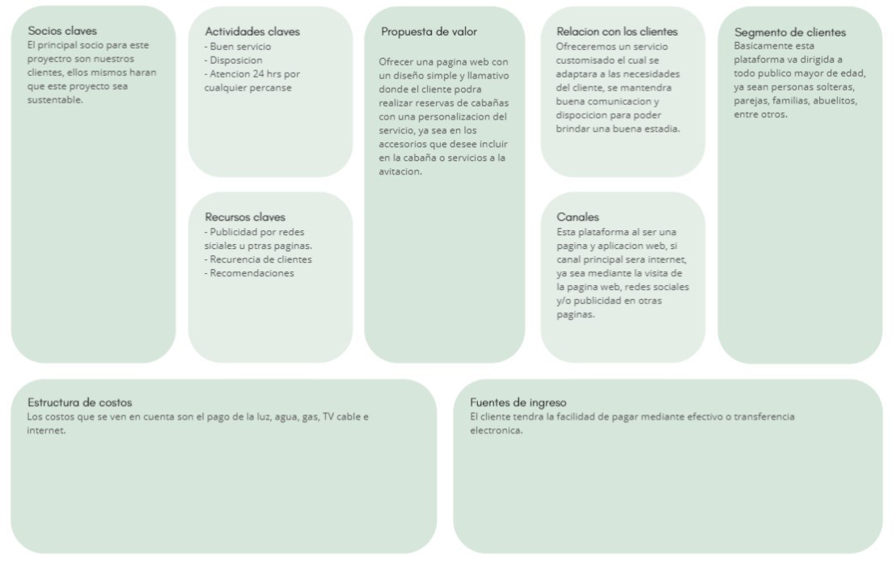

# Informe
-------------

## I. Resumen
Se realizara un proyecto para cabañas ubicadas especificamente en el sector de chamiza, 
donde se implementaran los conocimientos de programacion, comunicacion y se entreganaran
las soluciones que el cliente en cuestion necesita, para esto se buscara definir el 
problema u oportunidad que conlleva realizar este proyecto, el cliente busca o necesita
una aplicacion web que le permita manejar sus cabañas de una manera centralizada, ademas
de promocionar sus cabañas compartiendo su aplicacion web con un sistema innovador de 
arriendo, se estrucurara un modelo CANVAS donde se definen o integran las actividades
claves, propuesta de valor, canales, etc. Ademas se describira los interesados y posibles 
usuarios, en el proyecto se estableceran los problemas y oportunidades, ademas se defnira
la propuesta de solucion y los objetivos que busca abarcar el proyecto.

> Comentarios: Si bien contiene  todos los elementos necesarios en un resumen, su redacción no
     permite entender todo lo que quieren expresar. Falta uso de . , :. Existen frases muy largas     y no existe una revisión de ortografía. El mismo problema se da en otras frases del documento,     por lo que no realizare menciones posteriores con respecto a la gramática y redacción
## II. Descripción del problema

#### a) Descripción de la empresa o negocio
Es un negocio de arriendo de cabañas, el dueño consta con varias cabañas y casas en el sector de chamiza (carretera Austral) y a las cercanias de la universidad san sebastian. El cliente requiere una plataforma y aplicacion web en donde pueda promosionar y hacer reservas de sus propiedades.

> Comentarios: Falta información, cómo se llama el centro?, quién es el dueño?, cuántas cabañas tienen? Quien las administra?. Adicionalmente, las necesidades del cliente no van en esta sección

#### b) Problema u oportunidad
El cliente actualmente no posee un sistema de arriendo de sus propiedades y la publicidad de estas las hace por medio de redes sociales y otras paginas de busca de arriendo, pero para el servicio que quiere ofrecer a los clientes no es suficiente, ya que el quiere una plataforma en donde los clientes puedan personalizar sus arriendos, esto ultimo se refiere a que el cliente pueda elegir con que estaria equipado el domisilio y con que servicios.

> Comentarios: Faltan mas detalles, porque es un problema?, cuales son las consecuencias de esto?

#### c) Descripción del modelo de negocios

> Comentarios: Existe una inconsistencia en el modelo de negocios. Es una mezcla entre el modelo de negocios de las cabañas y el modelo de negocio del software. Si la estructura de costos es de las cabañas, entonces las fuentes de ingreso también tiene que ser de las cabañas.

#### d) Descripción de interesados y posibles usuarios
El principal interesado es el dueño de las cabañas debido a que este no consta de anuncio o publicidad que no sea la voz a voz, sin embargo, con la creación de la página web se vería aumentada la facilidad de propagar sus cabañas y propiedades al público en general.

El equipo de trabajo que realizaría el proyecto de la página web en conjunto con el dueño de las propiedades, ya que esto al equipo de trabajo le da experiencia e innovación dentro de este campo laboral.

Por último, los usuarios o personas que busquen arriendo ya sea para vivir o por un par de días, al ser un arriendo personalizado pueden pedir que tenga lo justo que necesitan para estar en la cabaña, además de un portal de internet cómodo con tutorial del cómo usar o ejemplos, para que no se les haga difícil poder utilizar la plataforma y poder llevar un arriendo con los que ellos necesitan en este.

## III. Propuesta de solución

#### a) Requisitos
Ubicación y números de casas o cabañas.
Plano de las propiedades.
Stock de inventario de lo que posee para equipamiento de las cabañas.

> Comentarios: Los requisitos están incompletos. Ni siquiera existe el requisito de que sea un sistema web!

#### b) Solución propuesta
Se implementara una plataforma web en donde se hará publicidad de las propiedades, se implementara un sistema de reserva personalizada la cual le permitirá al cliente poder tener la información mas centralizada, ordenada y poder saber el stock disponible de sus servicios con los cuales podrá equipar los domicilios.

> Comentarios: Falta un diagrama que ejemplifique la arquitectura del sistema.

#### c) Estudio factibilidad

#### d) Alcances y restricciones

## IV. Objetivos

#### a) General
Desarrollar Aplicacion web con arriendos personzalizados, de un solo cliente "Don Luis", donde el usaurio
o arrendatario debera ingresar y armar que quiere incluir dentro del arriendo, pudiendo asi solicitar servicios
extras a traves de la aplicacion web, generando reportes y solicitudes dentro de esta. 

> Comentarios: Falta el para que?, que tiene relación con el problema y/o oportunidad identificado. Todo lo que esta abajo no tiene sentido en un objetivo

este proyecto se desarrollara
en lenguaje C# donde se presentaran los mockups al cliente, donde estaran especificadas las solicitudes que este
presente tomando en cuenta la toma de requerimientos obtenidas.

#### a) Especifico
- definir requerimientos del software
- Diseñar y adminsitrar base da datos
- Conectar base de datos a aplicacion web
- Realizar pruebas de uso  para veritificar correcto fucionamiento de la aplicacion
- implementar procesos de calidad en el sistema
- Diseñar interfaz de aplicacion web

> Comentarios: Lo descrito como objetivos específicos, son en realidad tareas. Los objetivos son de mas alto nivel, que luego se pueden desglosar en esas tareas.

## V. Referencias Bibliográficas

